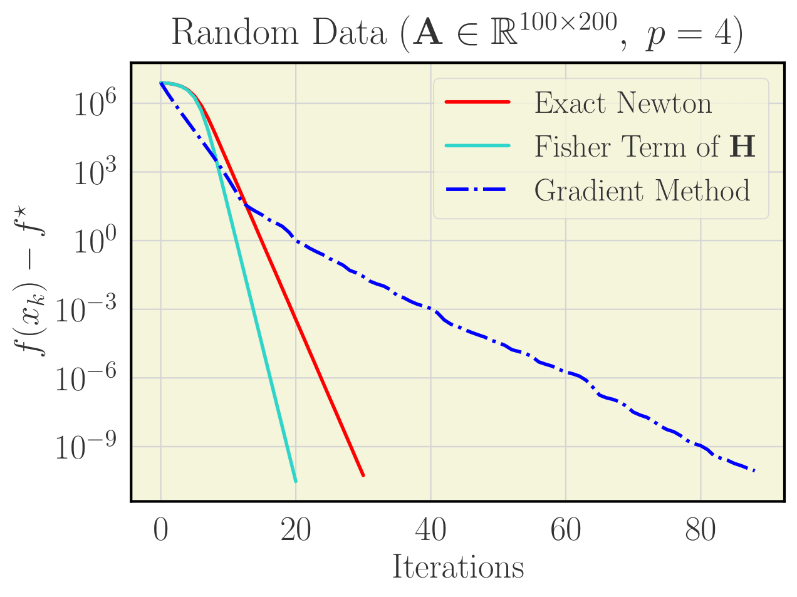
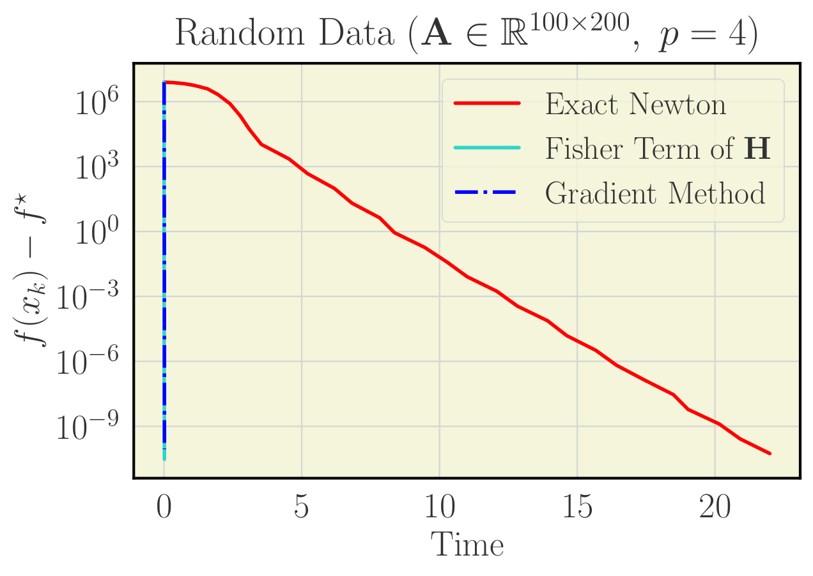

# Supplementary code for "Gradient-Normalized Smoothness for Optimization with Approximate Hessians"
[](https://arxiv.org/abs/2506.13710)

This code comes jointly with reference:

> Andrei Semenov, Martin Jaggi, Nikita Doikov.

Date:    June 2025

## Structure

```sh
src/
    methods.py         # Algorithm 1 from the paper, algorithms with other adaptive search schemes, gradient methods
    oracles.py         # LogSumExp, Nonlinear Equations with linear operator and Chebyshev polynomials,  Rosenbrock function, etc.
    approximations.py  # code for Hessian approximations for different oracles
    utils.py           # code for plotting graphs
    data/
        mushrooms.txt  # example of a dataset; you can add here more
notebooks/
    examples.ipynb     # examples of approximations and comparison of methods
```

## Quickstart

Simply run the ```examples.ipynb``` notebook.
At the beginning of the notebook, we provide practical approximations for each oracle.
All of them are compatible with our theory.
In particular, we investigated the following approximations.

| Problem | Naming in the paper | Approximation | Code reference in ```src/approximations.py```|
|---------|------|--------|-----|
| LogSumExp | Weighted Gauss-Newton |  $\frac{1}{\mu}\mathbf{A}^\top Diag\left(\mathrm{softmax}\left(\mathbf{A}, x\right)\right)\mathbf{A}$ | [```approx_hess_fn_logsumexp```](https://github.com/epfml/hess-approx/blob/0d294d9b65dc6bffb1434994abad8fba5a3aa7dd/src/approximations.py#L6) |
| Equations with linear operator | Fisher Term of $\mathbf{H}$ | $\frac{p-2}{\lVert u(x) \rVert^p} \nabla f(x) \nabla f(x)^\top$ | [```approx_hess_fn_fisher_term```](https://github.com/epfml/hess-approx/blob/0d294d9b65dc6bffb1434994abad8fba5a3aa7dd/src/approximations.py#L16) |
| Nonlinear Equations & Rosenbrock | Inexact Hessian | $\lVert u(x)\rVert^{p - 2} \nabla u(x)^\top \mathbf{B} \nabla u(x) + \frac{p - 2}{\lVert u(x) \rVert^p} \nabla f(x) \nabla f(x)^{\top}$ | [```approx_hess_nonlinear_equations```](https://github.com/epfml/hess-approx/blob/0d294d9b65dc6bffb1434994abad8fba5a3aa7dd/src/approximations.py#L31)|
|Nonlinear Equations & Chebyshev polynomials | Inexact Hessian | $\lVert u(x) \rVert^{p - 2} \nabla u(x)^\top \mathbf{B} \nabla u(x) + \frac{p - 2}{\lVert u(x) \rVert^p} \nabla f(x) \nabla f(x)^{\top}$ | [```approx_hess_fn_chebyshev```](https://github.com/epfml/hess-approx/blob/0d294d9b65dc6bffb1434994abad8fba5a3aa7dd/src/approximations.py#L51) |

You can also use a fast implementation of our algorithm, which corresponds to ```grad_norm_smooth_for_rank_one``` function in ```examples.py```.
Thus, you could obtain the following nice examples:

<p align="center">
  
  
</p>


**We believe the details provided are clear enough to reproduce the main findings of our paper.**
