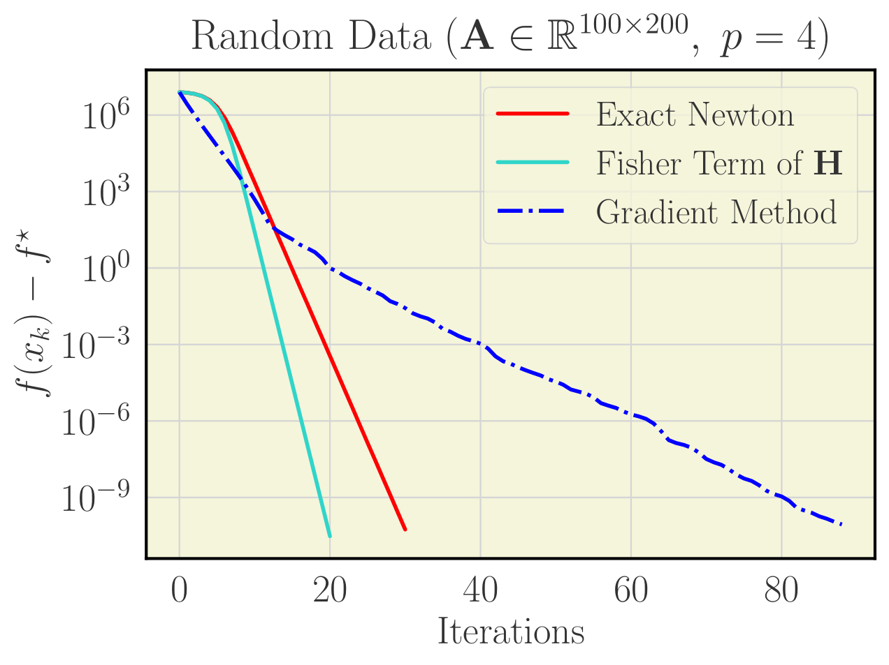
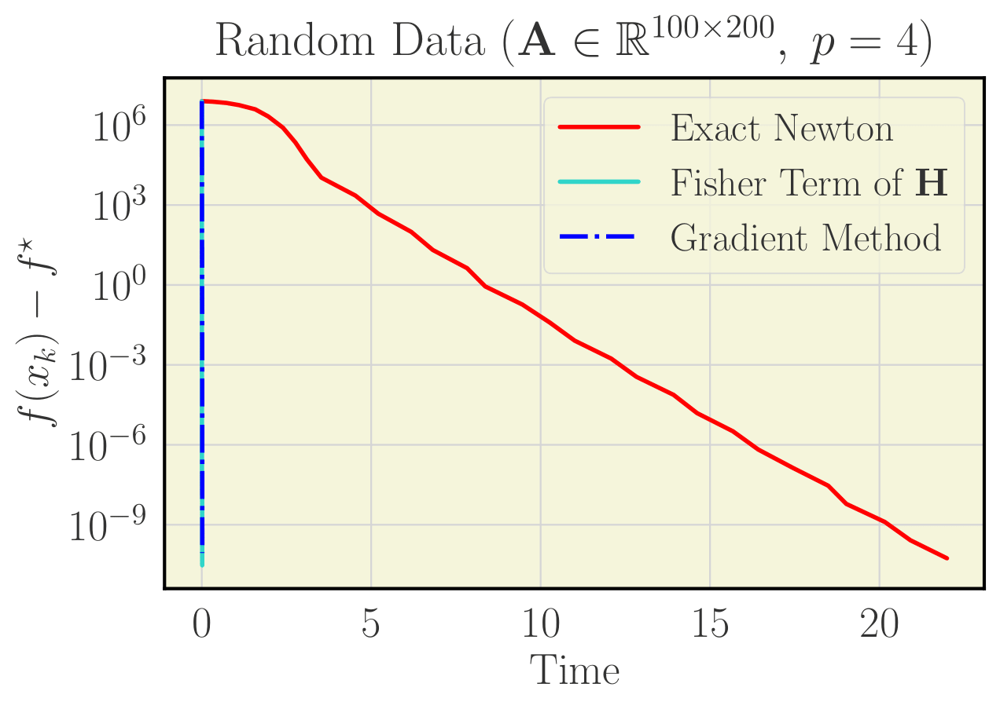

# Supplementary code for "Gradient-Normalized Smoothness for Optimization with Approximate Hessians"
[](https://arxiv.org/abs/2506.13710)
[](#contact--reference)

This code comes jointly with reference:

> Andrei Semenov, Martin Jaggi, Nikita Doikov.

Date:    June 2025

**Abstract:**
> In this work, we develop new optimization algorithms that use approximate second-order information combined with the gradient regularization technique to achieve fast global convergence rates for both convex and non-convex objectives. The key innovation of our analysis is a novel notion called Gradient-Normalized Smoothness, which characterizes the maximum radius of a ball around the current point that yields a good relative approximation of the gradient field. Our theory establishes a natural intrinsic connection between Hessian approximation and the linearization of the gradient. Importantly, Gradient-Normalized Smoothness does not depend on the specific problem class of the objective functions, while effectively translating local information about the gradient field and Hessian approximation into the global behavior of the method. This new concept equips approximate second-order algorithms with universal global convergence guarantees, recovering state-of-the-art rates for functions with Hölder-continuous Hessians and third derivatives, quasi-self-concordant functions, as well as smooth classes in first-order optimization. These rates are achieved automatically and extend to broader classes, such as generalized self-concordant functions. We demonstrate direct applications of our results for global linear rates in logistic regression and softmax problems with approximate Hessians, as well as in non-convex optimization using Fisher and Gauss-Newton approximations.

## Structure

```sh
src/
    methods.py         # Algorithm 1 from the paper, algorithms with other adaptive search schemes, gradient methods
    oracles.py         # LogSumExp, Nonlinear Equations with linear operator and Chebyshev polynomials,  Rosenbrock function, etc.
    approximations.py  # code for Hessian approximations for different oracles
    utils.py           # code for plotting graphs
    data/
        mushrooms.txt  # example of a dataset; you can add here more
notebooks/
    examples.ipynb     # examples of approximations and comparison of methods
```

## Quickstart

Simply run the ```examples.ipynb``` notebook.
At the beginning of the notebook, we provide practical approximations for each oracle.
All of them are compatible with our theory.
In particular, we investigated the following approximations.

| Problem | Naming in the paper | Approximation | Code reference in ```src/approximations.py```|
|---------|------|--------|-----|
| LogSumExp | Weighted Gauss-Newton |  $\frac{1}{\mu}\mathbf{A}^\top Diag\left(\mathrm{softmax}\left(\mathbf{A}, x\right)\right)\mathbf{A}$ | [```approx_hess_fn_logsumexp```](https://github.com/epfml/hess-approx/blob/0d294d9b65dc6bffb1434994abad8fba5a3aa7dd/src/approximations.py#L6) |
| Equations with linear operator | Fisher Term of $\mathbf{H}$ | $\frac{p-2}{\lVert u(x) \rVert^p} \nabla f(x) \nabla f(x)^\top$ | [```approx_hess_fn_fisher_term```](https://github.com/epfml/hess-approx/blob/0d294d9b65dc6bffb1434994abad8fba5a3aa7dd/src/approximations.py#L16) |
| Nonlinear Equations & Rosenbrock | Inexact Hessian | $\lVert u(x)\rVert^{p - 2} \nabla u(x)^\top \mathbf{B} \nabla u(x) + \frac{p - 2}{\lVert u(x) \rVert^p} \nabla f(x) \nabla f(x)^{\top}$ | [```approx_hess_nonlinear_equations```](https://github.com/epfml/hess-approx/blob/0d294d9b65dc6bffb1434994abad8fba5a3aa7dd/src/approximations.py#L31)|
|Nonlinear Equations & Chebyshev polynomials | Inexact Hessian | $\lVert u(x) \rVert^{p - 2} \nabla u(x)^\top \mathbf{B} \nabla u(x) + \frac{p - 2}{\lVert u(x) \rVert^p} \nabla f(x) \nabla f(x)^{\top}$ | [```approx_hess_fn_chebyshev```](https://github.com/epfml/hess-approx/blob/0d294d9b65dc6bffb1434994abad8fba5a3aa7dd/src/approximations.py#L51) |

You can also use a fast implementation of our algorithm, which corresponds to ```grad_norm_smooth_for_rank_one``` function in ```examples.py```.
Thus, you could obtain the following nice examples:

<p align="center">
  
  
</p>


**We believe the details provided are clear enough to reproduce the main findings of our paper.**


## Contact & Reference

Please do not hesitate to reach out to us if you have questions.

```bib
@article{semenov2025gradientnormalizedsmoothness,
  title={Gradient-{N}ormalized {S}moothness for {O}ptimization with {A}pproximate {H}essians},
  author={Semenov, Andrei and Jaggi, Martin and Doikov, Nikita},
  journal={arXiv preprint arXiv:2506.13710},
  url={https://arxiv.org/abs/2506.13710},
  year={2025}
}
```
